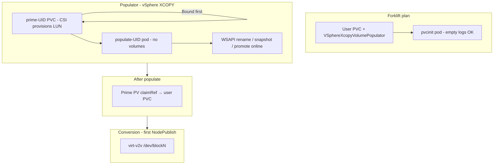

# Primera VVol copy-offload investigation summary

**Context:** MTV-5186 — VVol (and RDM) array-side copy via HPE Primera/3PAR WSAPI, then in-place `virt-v2v-in-place` on populated block PVCs.

**Cluster:** `hpe-standard-jfa` StorageClass — **`VolumeBindingMode: Immediate`** (not WaitForFirstConsumer).

**Last updated:** 2026-05-21

---

## Current status

| Area | Status |
|------|--------|
| **Populate / PVC bind** | **Validated** — 12 disk PVCs, `PopulatorFinished` → `Bound` (~27–50s per volume) |
| **Full migration (6 VMs)** | **Success** (2026-05-21) — all VMs migrated with in-place virt-v2v after populate |
| **Primera WSAPI path** | Rename → snapshot → promote (`online: true`) → unmap temp → delete temp — **no 403/409** on success run |
| **Mitigations in repo** | Prime **first** + **Bound** before populate pod; populate pod **without** `spec.volumes`; `unmapVolumeFromAllHosts` before temp delete; `waitGetPv` in populator binary |
| **Promote polling** | **`waitForTaskDone` not used** — `verifyTaskRunning` only; long promote wait did not fix earlier virt-v2v failures |

**Deploy both images after code changes:** `forklift-volume-populator-controller` + `vsphere-copy-offload-populator`.

---

## Successful validation run (2026-05-21)

**Plan:** 6 VMs (`6vms-aegl`), migration `5d389261-3286-4691-ada3-43558d80a26a`.

**Populator-controller:** `VSphereXcopyVolumePopulator` started; 12× `PopulatorCreated` → `PopulatorProgress` → `PopulatorFinished`. Metrics: `result=success`, `vendor=primera3par`, `method=vvol`, `xcopy=0`.

**Example populate pod** (`populate-07dc03c1-...`, build `v2.7.0-2446-g7aa10077d` + branch mitigations):

- VVol detected → Primera clone
- Prime PVC `prime-07dc03c1-...` used for `volumeHandle` (user PVC unbound at start)
- WSAPI: rename dest aside → snapshot → promote task verified → **`Deleted volume` temp** (no 409)
- Duration ~38s

**Benign controller noise:** `prime-<uid> in work queue no longer exists` after successful cleanup — stale workqueue entry after prime PVC delete.

### Cluster / operator naming (do not confuse with git `main`)

On installed MTV (e.g. labwl1), CRD and deployment use **XCOPY** names:

| Layer | Name |
|--------|------|
| ForkliftController spec | `populator_vsphere_xcopy_volume_image_fqin` |
| Deployment env | `VSPHERE_XCOPY_VOLUME_POPULATOR_IMAGE` |
| API kind | `VSphereXcopyVolumePopulator` |

This repo branch (≥ 2.12 rename) uses `populator_vsphere_copy_offload_image_fqin` / `VSPHERE_COPY_OFFLOAD_POPULATOR_IMAGE` in operator templates — **only relevant when CRD and operator match that version**.

**Logs:** use pod name, not `oc logs deploy/...` without `-c forklift-populator-controller` — shared label `app: forklift` matches multiple deployments.

```bash
oc logs -n openshift-mtv deployment/forklift-volume-populator-controller \
  -c forklift-populator-controller --tail=100
```

---

## End-to-end flow



1. Plan creates user PVCs with `copy-offload` annotation → **InPlace** conversion.
2. **`pvcinit-*`**: references Pending user PVCs in `spec.volumes` only — **no mounts, no logs**; not the populator.
3. **`prime-{user-pvc-uid}`**: CSI provisions empty target LUN; populator reads `volumeHandle` from prime PV (`waitGetPv`).
4. **`populate-{uid}`**: WSAPI only — **must not** reference prime in `spec.volumes` (avoids CSI NodePublish during swap).
5. **`CopyVolume`**: rename dest aside → snapshot as dest name → promote `online: true` → unmap/delete temp.
6. PV rebind to user PVC; **virt-v2v** is first real block consumer on conversion node.

---

## Root cause analysis (historical failures → fixes)

### 1. CSI publish during WSAPI (**403 Volume is exported**)

If the populate pod references the prime PVC, kubelet attaches the volume and CSI **NodePublish**s the LUN while WSAPI rename/promote runs on the same array object → promote can fail with **403**, and nodes retain conflicting paths.

**Fix:** Populate pod has **empty `spec.volumes`** for `VSphereXcopyVolumePopulator`; prime is created and waits **Bound** before the populate pod is created. Populator binary resolves target LUN via **`waitGetPv`** on the prime PVC.

### 2. Stale VLUN / temp delete (**409 resource in use**)

Renamed-aside temp volume may still be exported to hosts.

**Fix:** `unmapVolumeFromAllHosts(tempName)` before `deleteVolume(tempName)`.

### 3. Stale multipath on virt-v2v node

After name swap, consumers must see the promoted LUN’s WWN. Avoiding populate-pod publish + clean temp delete reduces stale paths; virt-v2v remains the **first** intentional block mount.

### 4. Promote task polling

`waitForTaskDone` (16–52s) on reference build **did not** fix virt-v2v. **`online: true`** + `verifyTaskRunning` (Active/Done) is sufficient for populate completion.

### 5. virt-v2v / EFI / disk order (earlier 2-VM failures)

vm-22014: EFI bootloader + sdb I/O. vm-22017: invalid sdb — disk order suspect. **Resolved** on 6-VM success run with mitigations above (orthogonal to WSAPI correctness).

---

## Storage class: Immediate (not WFFC)

| Topic | Immediate (`hpe-standard-jfa`) |
|--------|-------------------------------|
| Populator waits for `selected-node` | **No** |
| `populate` pod `spec.nodeName` | **Not set** |
| Prime binds | When prime PVC is **created** |
| Risk if prime in populate `spec.volumes` | CSI may publish on populator node during WSAPI |
| **Fix** | Prime **first**, wait **Bound**, populate pod **without volumes** |

---

## Primera `CopyVolume` (name swap)

File: `cmd/vsphere-copy-offload-populator/internal/primera3par/par3client.go`

| Step | Action |
|------|--------|
| 1 | Rename CSI dest `pvc-…` → random `tempName` |
| 2 | Snapshot source VVol **as** `pvc-…` (CoW) |
| 3 | Promote with **`online: true`** |
| 4 | **`unmapVolumeFromAllHosts(tempName)`** then `deleteVolume(tempName)` |

---

## Scope: what is and is not affected

| Migration / populator | Touched by these changes? |
|------------------------|---------------------------|
| **oVirt volume populator** | **No** — still mounts prime PVC, pod-before-prime order unchanged |
| **OpenStack volume populator** | **No** — same as oVirt |
| **vSphere copy-offload** (`VSphereXcopyVolumePopulator`) | **Yes** — all vendors (Primera, Pure, PowerMax, …): no prime in populate pod; prime-first |
| **Classic VDDK / warm copy (no offload)** | **No** — different plan path, no populator CR |
| **Primera WSAPI `CopyVolume` + unmap** | **Yes** — **Primera3par only**, used for **VVol and RDM** disks |
| **SCSI xcopy (VIB / SSH on VMDK)** | Controller only (no prime mount); clone logic in `remote_esxcli.go`, **not** `CopyVolume` |

Inside one `vsphere-copy-offload-populator` pod, disk type is auto-selected (`factory.go`): VVol → `VvolCopy`, RDM → `RDMCopy`, else → VMDK xcopy populator. Your 6-VM success run used **VVol** (`method=vvol`, `xcopy=0`).

---

## Code changes (MTV-5186 mitigations)

### Populator controller (`pkg/lib-volume-populator/populator-machinery/`)

| Change | File | Purpose |
|--------|------|---------|
| `ensureVSphereXcopyPrimeReady` | `controller_vsphere_xcopy.go` | Create prime first; requeue until Bound |
| `populatorPodReferencesPrimeVolume` | `controller_vsphere_xcopy.go` | false for XCOPY → no prime in populate `spec.volumes` |
| `populatorMountsPrimeVolume` | `controller_vsphere_xcopy.go` | no block mount on populate for XCOPY |
| `createPrimePVC` | `controller_vsphere_xcopy.go` | shared prime PVC creation |
| `requeuePVC` | `controller.go` | workqueue re-add after prime create (avoids Forgot) |
| `makePopulatePodSpecNoPrimeVolume` | `controller_vsphere_xcopy.go` | secret env only, no volumes |

### Primera client (`cmd/.../primera3par/par3client.go`)

- **`unmapVolumeFromAllHosts`** — VLUN unmap before temp delete.
- **`verifyTaskRunning`** — promote accepts Active/Done (no long poll).

### Populator binary (`vsphere-copy-offload-populator.go`)

- **`waitGetPv`** — poll until prime PVC bound and PV `volumeHandle` available (controller creates prime before populate pod).

---

## Recommended validation

```bash
# Prime bound before populate pod; populate pod has no volumes
PVC=6vms-aegl-disk-1-86e0db3d
UID=$(oc get pvc "$PVC" -n test-migrations -o jsonpath='{.metadata.uid}')
oc get pvc "prime-${UID}" -n test-migrations
oc get pod "populate-${UID}" -n test-migrations -o jsonpath='{.spec.volumes}{"\n"}'   # expect []

# Populate logs — promote OK, temp deleted
oc logs "populate-${UID}" -n test-migrations --tail=80

# Populator-controller (correct container)
oc logs -n openshift-mtv deploy/forklift-volume-populator-controller \
  -c forklift-populator-controller | grep -iE 'PopulatorFinished|primera3par'
```

---

## Debug commands

```bash
ls -la /var/tmp/v2v/*-sd* && readlink -f /var/tmp/v2v/*
ls -l /dev/block* /dev/disk/by-id/ | grep -i 60002ac
oc describe pvc <user-pvc>   # Events, volume, copy-offload annotation
```

---

## Related code paths

| Area | Path |
|------|------|
| CopyVolume / promote / unmap | `cmd/vsphere-copy-offload-populator/internal/primera3par/par3client.go` |
| VVol populate | `internal/primera3par/clonner.go` → `internal/populator/vvol_populator.go` |
| vSphere XCOPY controller behavior | `pkg/lib-volume-populator/populator-machinery/controller_vsphere_xcopy.go` |
| Shared sync / requeue | `pkg/lib-volume-populator/populator-machinery/controller.go` |
| waitGetPv / getPv | `cmd/vsphere-copy-offload-populator/vsphere-copy-offload-populator.go` |
| pvcinit | `pkg/controller/plan/kubevirt.go` |
| Disk symlinks | `pkg/virt-v2v/conversion/disk.go` |

---

## Summary

**VVol copy-offload on Primera is validated end-to-end (6 VMs).** Key fixes: do not publish prime LUN from the populate pod; provision prime and wait Bound first; unmap temp VLUNs before delete; populator waits for prime PV handle. Use cluster **XCOPY** CR/env names on installed MTV; use **COPY_OFFLOAD** names only on matching operator/CRD versions.
